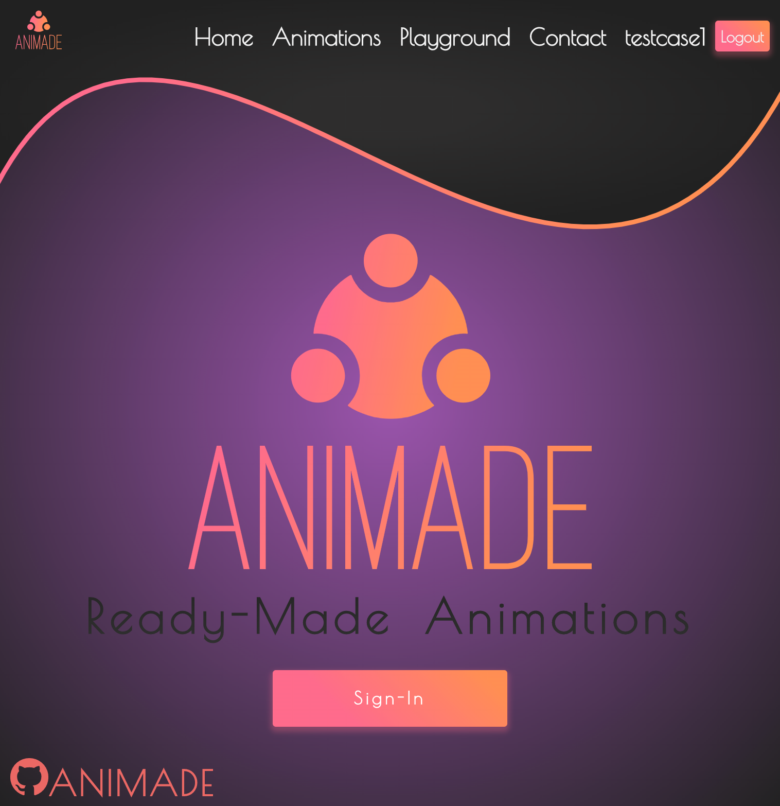
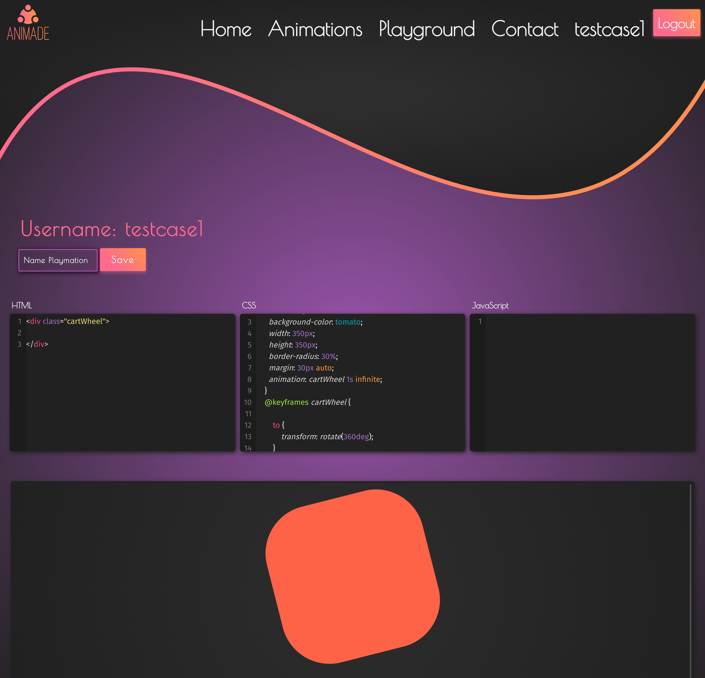
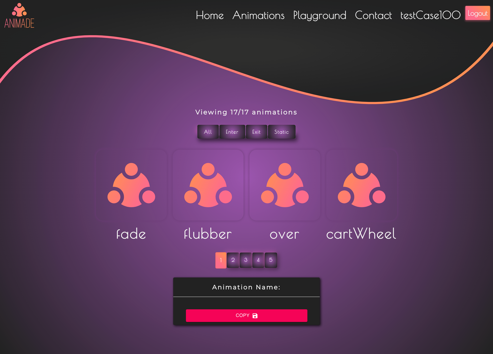
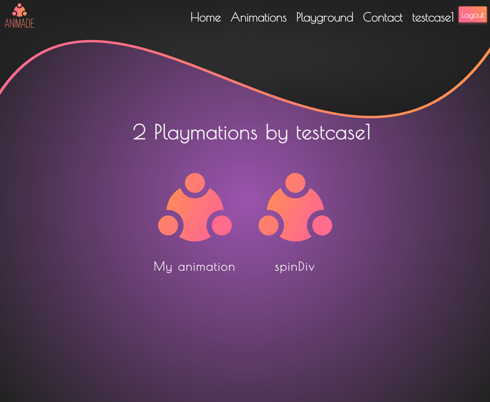

[View Live application](https://animade.herokuapp.com/)

# Animade

A Full Stack React Application allowing a user to choose between pre-made animations and edit them in the "Playground" IDE. Then users can save and edit thier creations and view them in thier profile page.

## How To Use

Sign in to create a user name. Then explore the ready made list of fun animations by hovering over each preview. Click on the animation you like and the code will display below! Then you can simply press the copy button and your code will be saved into your clipboard. You then can head over to the Playground and paste your code into the CSS input. Each Animation you copy will provide a class name that you should put onto your HTML Element that you want to animate. Then play around with the animation, give it a name, save it and head over to your profile where your custom Playmation will be waiting for you. Feel free to click on your custom playmation and it will redirect you into the playground and provide you back the custom Code that you have written.

## Tech Used / Dependencies

### MERN STACK

- React.Js
- material-ui
- node-sass
- bootstrap
- axios
- bcryptjs
- codemirror
- react-codemirror2
- connect-mongo
- cookie-parser
- express
- js-cookie
- lodash
- mongoose
- morgan
- react-copy-to-clipboard
- three.Js
- Heroku

## Authors

Cassidy Fortner [GitHub](https://github.com/Cassquatch)

Stephen Webb [GitHub](https://github.com/stevie2codes)
